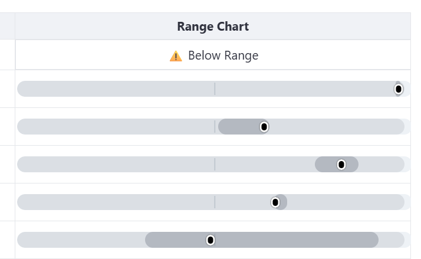

# Interactive Data Table Component for Streamlit

## A Word from the Karina

As an enthusiast and advocate for Python and Streamlit, I've always envisioned a future where dataframes and data editors are not just static entities but interactive canvases that respond to our touch. In the realm of data and analytics, the power to drill down into specifics with a simple click, influencing filters and altering visualizations, is not just a convenience—it's a necessity.

While the wonderful team at Streamlit is paving the way for such interactive features, some of us need them right now. And that's precisely why I created this custom component. Until Streamlit rolls out the official interactive tables, let's come together to use, improve, and maintain this component. It's a tribute to the vibrant community that always finds a way to make things work!

## About This Component

The Interactive Data Table component for Streamlit goes far beyond the capabilities of standard tables. It combines clickable cells with rich data visualizations, dynamic styling, and interactive features that make your data come alive. This component enables users to:

- Click on any cell to capture its data for use in downstream filtering or visualization
- Display rich data visualizations directly within table cells
- Apply customized visual indicators for recommended values
- Create interactive tooltips that reveal additional context
- Style specific columns with conditional formatting
- And much more!

This component takes full advantage of pandas' powerful `Styler` object while adding layers of interactivity and visualization capabilities that static tables simply can't provide.

## Screenshot


## Features

- **Clickable Cells**: Click on any cell to capture its data for use in filters or other visualizations
- **Data Bar Charts**: Display proportional bars for numeric data with customizable min/max values
- **Recommended Value Indicators**: Show target/recommended values with customizable line colors
- **Interactive Tooltips**: Hover over cells to see detailed information including target values
- **David Hum Columns**: Named after my dear colleague David Hum, these special columns display percentage bars for numeric values while highlighting text values with custom background colors (a somewhat speechless requirement, but David is great, so I implemented it anyway!)
- **Range Charts**: Visualize data ranges with customizable dots representing values like high/low points
- **Column-Specific Styling**: Apply conditional formatting only to specific columns
- **Hidden Calculation Columns**: Hide columns that are needed for calculations but not for display
- **Custom Column Widths**: Set specific widths for each column for better readability
- **Streamlit Theme Integration**: Automatically adapts to your Streamlit theme colors

## Get Started

### Installation

To bring interactive tables into your Streamlit applications, download the whl file from the dist folder, install the component using pip:

```bash
pip install clickable_table-0.0.7.5-py3-none-any.whl
```

## Usage
Here's a simple example of how to use the Interactive Data Table component in your Streamlit app:

```python
import streamlit as st
from clickable_table import clickable_table
import pandas as pd

st.subheader("Interactive Data Table Example")

# Sample data
data = {
    'Epoch': ["R 1", "R 2", "R 3", "R 4", "R 5", "Total"],
    'Revenue': [2087627, -872765, -145564, -337304, 74001, 805085],
    'Revenue Target': [2500000, -500000, 0, -200000, 100000, 900000],
    'Margin %': [83.5, -34.9, -11.7, -33.7, 7.4, 32.2],
    'Long Term High': [1.290, 1.382, 1.361, 1.268, 1.160, 1.028],  
    'Long Term Low': [0.260, 0.218, 0.353, 0.296, 0.266, 0.390],  
    'Range Chart': ["", "", "", "", "", ""]  
}

def style_dataframe(df, columns_to_style=None):
    """Apply styling to specific columns"""
    def apply_conditional_formatting(val):
        try:
            val = float(val)
            if val > 500:
                return 'background-color: #FFC0CB'  
            elif val < -500:
                return 'background-color: #90EE90'  
            return ''
        except ValueError:
            return None
    
    # Apply styling only to specified columns
    if columns_to_style:
        col_names = [df.columns[i] for i in columns_to_style if i < len(df.columns)]
        return df.style.applymap(apply_conditional_formatting, subset=col_names)
    else:
        return df.style.applymap(apply_conditional_formatting)

# Create DataFrame and set index
df = pd.DataFrame(data)
df = df.set_index("Epoch")
df.index.name = None

# Configure visualizations
data_bar_columns = [
    {'col_idx': 1, 'min': -1000000, 'max': 2500000, 'recommended_idx': 2, 'line_color': '#FF0000'}
]

range_chart = [
    {'col_idx': 6, 
     'long_term_high_idx': 4,
     'long_term_low_idx': 5,
     'long_term_color': 'blue', 
     'current_color': 'black'
    }
]

column_width = ['100px', '120px', '120px', '100px', '100px', '100px', '150px']
hidden_columns = [2]  # Hide the target column

# Create the interactive table
return_value = clickable_table(
    df=df,
    styling_function=lambda df: style_dataframe(df, [1]),  # Only style the Revenue column
    data_bar_columns=data_bar_columns,
    range_chart=range_chart,
    idx_col_name='Tenor Bucket',
    column_width=column_width,
    hidden_columns=hidden_columns,
    max_height="300px",
    key="test"
)

# Display return value when cell is clicked
if return_value:
    st.markdown(f"### Selected Cell")
    st.json(return_value)
```

## Advanced Visualization Options

### Data Bar Charts with Recommended Values
Create proportional bar charts inside cells with negative and positive values, plus recommended value indicators:

```python
data_bar_columns = [
    {
        'col_idx': 1,                # Column index to display the bar chart
        'min': -1000000,             # Minimum value for scaling
        'max': 2500000,              # Maximum value for scaling
        'recommended_idx': 2,        # Column containing recommended/target values
        'line_color': '#0000FF'      # Color for the recommendation indicator lines
    }
]
```


### David Hum Columns
Special columns display percentage bars for numeric values while highlighting text values with custom background colors:

```python
david_hum_columns = [
    {'col_idx': 4, 'min': 0, 'max': 100, 'exception_col_color': "yellow"},
    {'col_idx': 5, 'min': 0, 'max': 100, 'exception_col_color': "lightblue"}
]
```


### Range Charts
Visualize ranges with dots representing different values:

```python
range_chart = [
    {'col_idx': 10,                    # Column to display the chart
     'long_term_high_idx': 5,          # Column index with long term high values
     'long_term_low_idx': 6,           # Column index with long term low values
     'short_term_high_idx': 7,         # Column index with short term high values
     'short_term_low_idx': 8,          # Column index with short term low values
     'current_idx': 9,                 # Column index with current values
     'long_term_color': 'blue',        # Color for long term dots
     'short_term_color': 'green',      # Color for short term dots
     'current_color': 'black'          # Color for current value dot
    }
]
```


### Column-Specific Styling
Apply conditional formatting to only specific columns:

```python
# Define columns to style (by column index, 0-based)
columns_to_style = [1, 3]  # Only style the Revenue and Margin columns

# Create function to apply styling
def style_specific_columns(df):
    return style_dataframe(df, columns_to_style)

# Use in clickable_table
clickable_table(
    df=df,
    styling_function=style_specific_columns,
    # ... other parameters ...
)
```

### Hiding Calculation Columns
Some visualizations (like range charts or recommended values) need data columns that you might not want to display. You can hide these columns while still using their values for calculations:

```python
# Specify which columns to hide (by index)
hidden_columns = [2, 6, 7, 8, 9]  # Hide target and calculation columns

# The columns will be hidden but still available for calculations
clickable_table(
    # ... other parameters ...
    hidden_columns=hidden_columns
)
```

### Interactive Tooltips
When hovering over data bar charts with recommended values, a tooltip will automatically appear showing both the actual and target values along with their column names.

## Contributing
If you'd like to contribute to this component, please feel free to make a pull request.

## License
This project is licensed under the MIT License - see the LICENSE file for details.