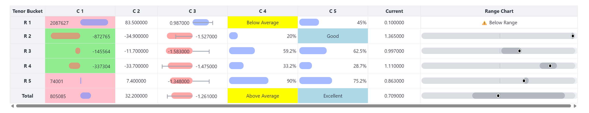
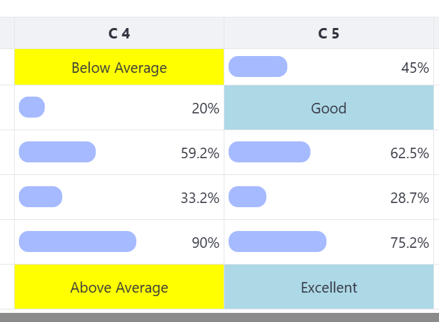

# Clickable Table - Streamlit Custom Component

A powerful, interactive table component for Streamlit with advanced visualization features including data bar charts, David Hum charts, range charts, and custom text display capabilities.



## Features

### 🎯 **Interactive Table**
- Clickable cells with return values
- Custom styling support
- Responsive design with configurable heights

### 📊 **Data Bar Charts**
- Visual representation of numeric values
- Customizable min/max ranges
- Recommended value markers with custom colors
- Hover tooltips showing actual vs. recommended values
- Support for both positive and negative values


### 🎨 **David Hum Charts**
- Percentage-based visualizations
- Exception highlighting for non-numeric values
- Customizable color schemes



### 📈 **Range Charts**
- Clean band design for long/short‑term ranges with a current marker
- Palette options (muted, professional, warm/cool, grayscale) for accessibility
- Optional text display when current is outside both ranges (below or above)


### 🔧 **Advanced Configuration**
- Column width customization
- Hidden column support via CSS
- Flexible styling functions
- Comprehensive configuration options

## Installation

```bash
pip install clickable-table
```

## Quick Start

```python
import streamlit as st
from clickable_table import clickable_table
import pandas as pd

# Sample data
data = {
    'Metric': ['Revenue', 'Growth', 'Score'],
    'Value': [1000, 50, 80],
    'Target': [1200, 60, 90]
}

df = pd.DataFrame(data)

# Create the clickable table
return_value = clickable_table(
    df=df,
    key="example"
)

if return_value:
    st.json(return_value)
```

## Advanced Usage

### Data Bar Charts with Recommended Values

```python
data_bar_columns = [
    {
        'col_idx': 1,  # Column index
        'min': -100,   # Minimum value
        'max': 100,    # Maximum value
        'recommended_idx': 2,  # Column with recommended value
        'line_color': '#000000'  # Custom marker color
    }
]

clickable_table(
    df=df,
    data_bar_columns=data_bar_columns,
    key="advanced"
)
```

### Range Charts with Text Display

```python
range_chart = [
    {
        'col_idx': 5,  # Range chart column
        'long_term_high_idx': 1,    # Long term high values
        'long_term_low_idx': 2,     # Long term low values
        'short_term_high_idx': 3,   # Short term high values
        'short_term_low_idx': 4,    # Short term low values
        'current_idx': 5,           # Current values
        'long_term_color': 'blue',  # Long term dot color
        'short_term_color': 'green', # Short term dot color
        'current_color': 'red',     # Current value dot color
        'low_text': '⚠️ Below Range', # Text when current < both lows
        'high_text': '⚠️ Above Range' # Text when current > both highs
    }
]

clickable_table(
    df=df,
    range_chart=range_chart,
    key="range_example"
)
```

### David Hum Charts

```python
david_hum_columns = [
    {
        'col_idx': 3,  # Column index
        'min': 0,      # Minimum value
        'max': 100,    # Maximum value
        'exception_col_color': "yellow"  # Color for non-numeric values
    }
]

clickable_table(
    df=df,
    david_hum_columns=david_hum_columns,
    key="david_hum_example"
)
```

### Column Customization

```python
# Custom column widths
column_width = ['100px', '150px', '200px']

# Hide specific columns
hidden_columns = [2, 4]  # Column indices to hide

clickable_table(
    df=df,
    column_width=column_width,
    hidden_columns=hidden_columns,
    hidden_column_class="hide-column",
    key="custom_example"
)
```

## Configuration Parameters

| Parameter | Type | Description |
|-----------|------|-------------|
| `df` | DataFrame | **Required** - The pandas DataFrame to display |
| `styling_function` | function | Optional styling function for the DataFrame |
| `data_bar_columns` | list | List of data bar chart configurations |
| `david_hum_columns` | list | List of David Hum chart configurations |
| `range_chart` | list | List of range chart configurations |
| `idx_col_name` | str | Custom name for the index column |
| `column_width` | list | List of column width values |
| `max_height` | str | Maximum height of the table container |
| `hidden_column_class` | str | CSS class for hidden columns |
| `hidden_columns` | list | List of column indices to hide |
| `key` | str | Unique key for the component instance |

## Range Chart Text Display

The range chart component now supports displaying custom text when the current value falls below both the short-term and long-term low thresholds. This is useful for highlighting values that are outside the expected range.

### How It Works

The text will be displayed when:
```python
current < short_term_low AND current < long_term_low
```

### Configuration

Add the `low_text` parameter to your range chart configuration:

```python
range_chart = [
    {
        'col_idx': 5,
        'long_term_high_idx': 1,
        'long_term_low_idx': 2,
        'short_term_high_idx': 3,
        'short_term_low_idx': 4,
        'current_idx': 5,
        'long_term_color': 'blue',
        'short_term_color': 'green',
        'current_color': 'red',
        'low_text': '⚠️ Below Range'  # Text to display
    }
]
```

### Behavior

- **When text is displayed**: The entire range chart (dots and lines) is replaced by the text
- **When text is not displayed**: The normal range chart with dots and lines is shown
- **Styling**: The text appears with a warning-style appearance (red text, light red background, border)
 - Supports both below-range (`low_text`) and above-range (`high_text`) messages

## Styling

The component includes built-in CSS classes that you can customize:

- `.range-chart-text`: Styles for the range chart warning text
- `.range-chart-cell`: Ensures proper positioning for range chart elements
- `.hide-column`: Hides columns when applied

## Examples

Check out the `example.py` file for comprehensive examples of all features.

## Development

To develop locally:

1. Set `_RELEASE = False` in `__init__.py`
2. Run `npm start` in the `frontend` directory
3. The component will use localhost:3000 for development

## Version History

### 1.0.0
- Complete visual refresh: rounded bars, centered axis, softer palette
- Range chart redesigned to bands + current marker; palette options
- Recommendation marker clarity: medium‑gray connector and marker, overlap‑aware text
- Consistent data bars across columns; improved negative/positive styling
- Docs and screenshots updated

### 0.0.7.8
- Range chart text display when values are above thresholds

### 0.0.7.7
- ✨ **NEW**: Range chart text display when values are below thresholds
- 🔧 Fixed deprecated `applymap` warnings
- 🐛 Resolved Arrow conversion issues
- 📚 Enhanced documentation and examples

### 0.0.7.6
- 🎨 Custom line colors for data bar charts
- 🔍 Hover tooltips with actual vs. target values
- 📊 Column-specific styling support

## Requirements

- Python >= 3.7
- Streamlit >= 0.63
- pandas
- React (for development)

## License

This project is licensed under the MIT License - see the LICENSE file for details.

## Contributing

Contributions are welcome! Please feel free to submit a Pull Request.